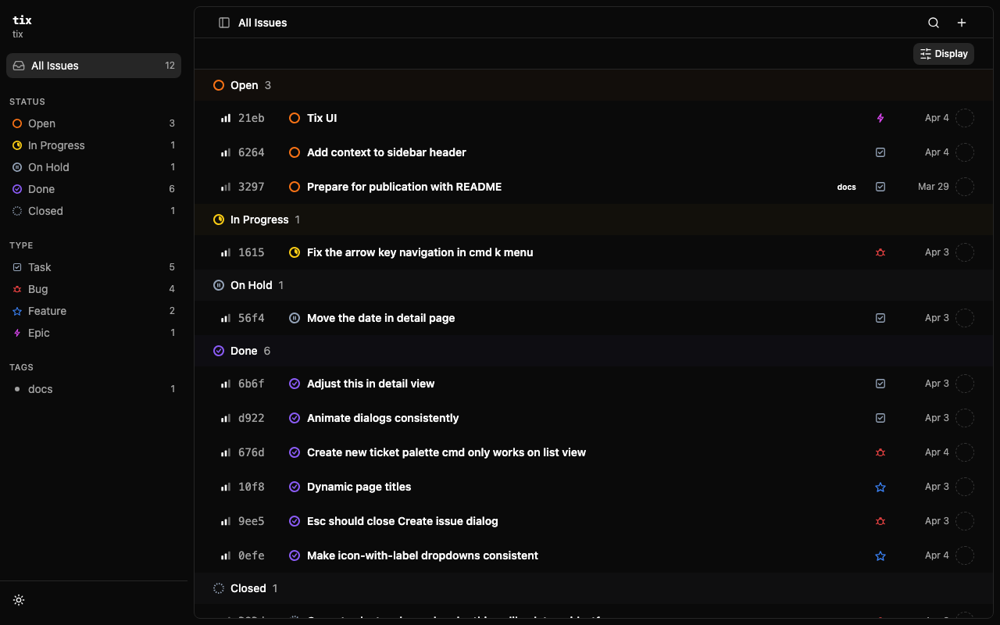

# tix

A Markdown ticket tracker in a shell script.

- Tickets are Markdown files with YAML frontmatter in `./tickets/`
- No server, no database — just files that diff, merge, and grep like code
- Works in any editor: Vim, VS Code, Obsidian
- Dependency tracking, kanban views, auto-archiving
- Versioned with your code in Git

## Tix Web UI



## How It Works

Each ticket is a Markdown file named like `Fix The Login Bug (a1b2).md`. The 4-character hex ID is embedded in the filename.

```yaml
---
id: a1b2
title: "Fix the login bug"
status: open
priority: 2
type: bug
assignee: Winston
deps: []
tags: [auth]
created: 2026-03-29T12:00:00Z
---
```

The body is freeform Markdown — description, design notes, acceptance criteria.

When a ticket is marked `done` or `closed`, it moves to `archive/YYYY-MM-DD/` automatically.

## Install

One-liner:

```bash
curl -fsSL https://raw.githubusercontent.com/WinstonFassett/tix/main/install.sh | bash
```

Or clone and install manually:

```bash
git clone https://github.com/WinstonFassett/tix.git ~/.tix
~/.tix/setup-deps && ~/.tix/install-tix
```

Both clone to `~/.tix`, download vendored dependencies (yq, jq), and symlink `tix` into your PATH.

## Quick Start

```bash
cd your-project
tix create "Fix the login bug"
tix ls
tix start a1b2
tix done a1b2
```

## Usage

### Tickets

```
tix create <title>          Create a ticket (returns its 4-hex ID)
tix show <id>               Display full ticket details
tix file <id>               Print path to ticket file
tix rename <id> <title>     Rename a ticket
tix delete <id>             Permanently delete a ticket
```

`create` accepts flags: `--description`, `--priority 0-4`, `--type`, `--assignee`, `--tags`, `--folder` (e.g. `backlog`).

### Workflow

```
tix start <id>              Set status to in-progress
tix done <id>               Mark done and archive
tix close <id>              Mark closed (won't-do) and archive
tix reopen <id>             Reopen a ticket
```

### Lists

```
tix ls                      Active tickets (open + in-progress)
tix ls --all                Include done/closed
tix ls --deep               Include subfolders
tix ready                   Tickets with all deps resolved
tix blocked                 Tickets with unresolved deps
tix closed                  Recently completed tickets
```

Filter any list with `--status`, `-a <assignee>`, `-T <tag>`.

### Dependencies and Links

```
tix dep <id> <dep-id>       Add a dependency
tix undep <id> <dep-id>     Remove a dependency
tix dep tree                Show full dependency tree
tix dep cycle               Detect cycles
tix link <id1> <id2>        Bidirectional link between tickets
```

### Notes and Acceptance Criteria

```
tix add-note <id> "text"    Add a timestamped note
tix add-ac <id> "criterion" Add an acceptance criterion
tix check <id> <n>          Toggle AC checkbox
```

### Obsidian

```
tix vault open              Open workspace as an Obsidian vault
tix vault init              Set up .obsidian config for tickets
```

## Configuration

| Variable | Purpose |
|----------|---------|
| `TIX_WORKSPACE` | Override workspace root (tickets dir = `$TIX_WORKSPACE/tickets/`) |
| `TICKETS_DIR` | Point directly at a tickets directory |
| `TICKET_WORKSPACE` | Legacy fallback for `TIX_WORKSPACE` |

## Development

```bash
./setup-deps              # Download vendored yq + jq into lib/
bats test/                # Run the test suite (requires bats-core)
```

## See Also

- [tix-ui](tix-ui/) — Web dashboard for browsing tickets (Svelte + Vite)
- [skills/tix](skills/tix/) — Agent skill definition for AI-assisted ticket management

## Uninstall

```bash
~/.tix/uninstall-tix
```
