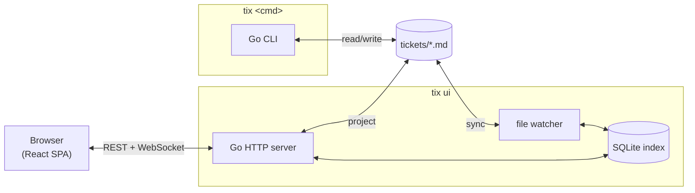

# tix

Tickets in Markdown, indexed in SQLite. CLI for agents, rich realtime UI for humans.


- Tickets are Markdown files with YAML frontmatter in `./tickets/` — like `.git/`, but for tasks
- CLI needs no server or database — files that diff, merge, and grep like code
- Works in any editor: Vim, VS Code, Obsidian
- Dependency tracking, kanban views, auto-archiving
- `tix ui` launches a full React dashboard with live updates

## Quick Start

```sh
$ cd your-project
$ tix create "Fix the login bug" --type bug
Created ticket a1b2 at:
tickets/Fix The Login Bug (a1b2).md

$ tix ls
a1b2     [open bug] - Fix the login bug

$ tix start a1b2
$ tix ls
a1b2     [in-progress bug] - Fix the login bug

$ tix done a1b2
$ tix ui
```

## Web Dashboard

`tix ui` starts a local Go HTTP server with an embedded React SPA and opens your browser.

- Live updates via WebSocket — CLI edits and file changes appear instantly
- Linear-style list and board views, collapsible group headers, URL-driven filters
- Detail view with inline Markdown editing, prev/next pager, tag autocomplete
- Command palette (⌘K) with ticket search

## Architecture



`tix` CLI reads and writes `.md` files directly — no server needed. `tix ui` runs a persistent server that keeps a SQLite index in sync with those same files: UI mutations write through to both, and the file watcher picks up external edits (CLI, editor) and syncs them back.

## Ticket Format

Each ticket is a Markdown file named like `Fix The Login Bug (a1b2).md`.

```yaml
---
id: "a1b2"
title: "Fix the login bug"
status: open
priority: 2
type: bug
assignee: Winston
deps: []
tags: [auth]
created: 2026-03-29T12:00:00Z
---
```

The body is freeform Markdown — description, design notes, acceptance criteria.
IDs are quoted so values like `0e48` aren't parsed as scientific notation.

## Install

```sh
# curl — no dependencies required
curl -fsSL https://raw.githubusercontent.com/WinstonFassett/tix/main/install.sh | bash

# npm — if you're already in the Node ecosystem
npm install -g @winstonfassett/tix

# one-off, no install
npx @winstonfassett/tix
```

| Method | First run | Subsequent |
|--------|-----------|------------|
| `curl \| bash` or `npm install -g` | ~300ms | **~50ms** |
| `npx` | ~1.8s | ~1.5s |

`npm install -g` and `curl \| bash` both install the same Go binary — `npx` re-invokes Node on every run and is noticeably slower. Use `npx` for one-offs only.

**Optional:** install [portless](https://www.npmjs.com/package/portless) for stable named URLs when using `tix ui`:

```sh
npm install -g portless
```

With portless, `tix ui` automatically serves at `http://my-project-tix.localhost:1355` instead of a random port — bookmarkable and collision-free across projects.

## Commands

### Tickets

```
tix create <title>          Create a ticket (returns its 4-hex ID)
tix show <id>               Display full ticket details
tix file <id>               Print path to ticket file
tix rename <id> <title>     Rename a ticket
tix delete <id>             Permanently delete a ticket
tix edit <id>               Open ticket in $EDITOR
```

`create` accepts flags: `--description`, `--priority 0-4`, `--type`, `--assignee`, `--tags`, `--folder`.

### Workflow

```
tix start <id>              Set status to in-progress
tix hold <id>               Set status to on-hold
tix done <id>               Mark done
tix close <id>              Mark closed (won't-do)
tix reopen <id>             Reopen a ticket
tix status <id> <status>    Set explicit status
```

Valid statuses: `open`, `in-progress`, `review`, `on-hold`, `done`, `closed`.

### Lists

```
tix ls                      Active tickets (open + in-progress)
tix ls --all                Include done/closed
tix ls --deep               Include subfolders
tix ready                   Tickets with all deps resolved
tix blocked                 Tickets with unresolved deps
tix closed                  Recently completed tickets
```

Filter any list with `--status`, `-a <assignee>`, `-T <tag>`.

### Dependencies

```
tix dep <id> <dep-id>       Add a dependency
tix undep <id> <dep-id>     Remove a dependency
tix dep tree                Show dependency tree
tix dep cycle               Detect cycles
```

### Notes and Acceptance Criteria

```
tix add-note <id> "text"    Add a timestamped note
tix add-ac <id> "criterion" Add an acceptance criterion
tix check <id> <n>          Toggle AC checkbox (1-indexed)
```

### Maintenance

```
tix archive                 Move done/closed tickets ≥3 days old to archive/YYYY-MM-DD/
tix archive --days=N        Override the age cutoff (default: 3)
tix archive --all           Archive all done/closed regardless of age
tix backup                  Zip the tickets/ directory
tix version                 Print build version
```

## Configuration

| Variable | Purpose |
|----------|---------|
| `TIX_WORKSPACE` | Override workspace root (`$TIX_WORKSPACE/tickets/`) |
| `TICKETS_DIR` | Point directly at a tickets directory |

## See Also

- [docs/release-pipeline.md](docs/release-pipeline.md) — how the binary is built and distributed
- [skills/tix](skills/tix/) — agent skill for AI-assisted ticket management
