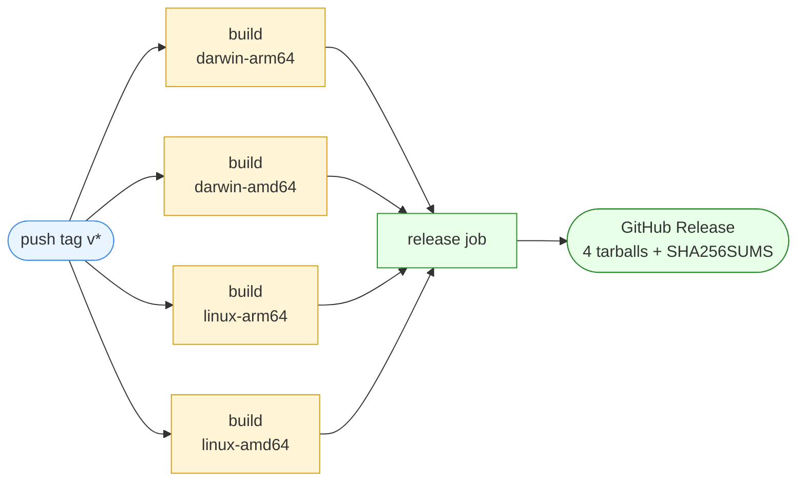
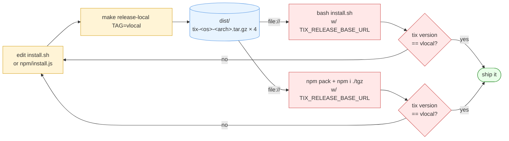

# Release pipeline — how `tix` ships

## The goal

A user runs one command and has `tix` on their PATH:

```sh
# if you're not in the Node ecosystem:
curl -fsSL https://raw.githubusercontent.com/WinstonFassett/tix/main/install.sh | bash

# if you are:
npm install -g @winstonfassett/tix
```

Both commands install the **exact same binary**. There is one artifact — a
Go binary cross-compiled for each platform — and two on-ramps to it. The
on-ramps exist for audience reach: the curl path works on any Unix box
without Node; the npm path is natural for JS/TS developers who want
`npm install -g` or per-project version pinning via `npx`. Either way the
user ends up with identical `tix` functionality.

Everything else in this doc — GitHub Actions, tarballs, the tar parser, the
npm postinstall — is the machinery that makes those two lines possible.

---

If you've never set up a binary release pipeline before, read top to bottom.
If you're just trying to cut a release, jump to [Cutting a real release](#cutting-a-real-release).

---

## The big picture

One artifact, two on-ramps:

```mermaid
flowchart TD
    tag([git push tag vX.Y.Z]) --> gha
    gha[GitHub Actions<br/>release.yml]
    gha -->|cross-compile × 4| tarballs[(GitHub Release<br/>tix-darwin-arm64.tar.gz<br/>tix-darwin-amd64.tar.gz<br/>tix-linux-arm64.tar.gz<br/>tix-linux-amd64.tar.gz<br/>SHA256SUMS)]
    tarballs --> sh[install.sh<br/>curl &#124; bash]
    tarballs --> npm[npm postinstall<br/>&#64;winstonfassett/tix]
    sh --> bin1[~/.local/bin/tix]
    npm --> bin2[node_modules/.../tix-bin<br/>+ bin/tix.js shim]
    bin1 --> path([on user's PATH])
    bin2 --> path

    classDef src fill:#e8f4ff,stroke:#4a90e2;
    classDef build fill:#fff4d6,stroke:#d4a017;
    classDef install fill:#e8ffe8,stroke:#2e8b2e;
    class tag src;
    class gha,tarballs build;
    class sh,npm,bin1,bin2,path install;
```



Two install paths, one source of truth (the GitHub Release).

---

## The Go binary

Built from `tix-server/` (poorly named at this point — it's both server and
CLI). Build flag wires the version in:

```sh
go build -ldflags "-X main.buildVersion=v1.2.3" -o tix .
```

`main.buildVersion` is a package-level `var` in `tix-server/cmd_util.go`.
The `-X` flag rewrites it at link time. `tix version` prints it. Default
when built without the flag: `dev`.

For release builds we also pass `-trimpath` (strip absolute build paths from
the binary, makes builds reproducible) and `-ldflags "-s -w"` (strip
debug/symbol tables, ~30% smaller binary).

The React UI gets compiled into `tix-server/ui/` and embedded via Go's
`embed.FS` at compile time, so the final binary needs no companion files.

---

## GitHub Actions: `.github/workflows/release.yml`

### Trigger

```yaml
on:
  push:
    tags:
      - 'v*'
```

The workflow only runs when you push a tag matching `v*` (e.g. `v0.1.0`).
Branch pushes do nothing. To fire it: `git tag v0.1.0 && git push --tags`.

### Permissions

```yaml
permissions:
  contents: write
```

Default `GITHUB_TOKEN` is read-only. Creating a release requires write
access to the repo's contents. Set per-workflow rather than globally so
that other workflows stay locked down.

### `build` job — matrix cross-compile

```yaml
strategy:
  matrix:
    include:
      - { os: darwin, arch: arm64 }
      - { os: darwin, arch: amd64 }
      - { os: linux,  arch: arm64 }
      - { os: linux,  arch: amd64 }
```

GitHub spawns 4 parallel runners, each on `ubuntu-latest` (we're
cross-compiling, so the runner OS is irrelevant — Go can target any
platform from any host). Each one:

1. Checks out the repo.
2. Sets up Node + Go (with caching by `package-lock.json` / `go.sum`).
3. Builds the React UI (`npm ci && npm run build:go`) and copies the dist
   into `tix-server/ui/` so it gets embedded.
4. Cross-compiles via `GOOS=$os GOARCH=$arch go build`.
5. Tars the binary as `dist/tix-<os>-<arch>.tar.gz`.
6. Uploads it as a workflow artifact (scoped to that matrix cell).

Naming convention: **no version in the filename**. The version is embedded
in the binary. Why? So the GitHub "latest" URL works without a redirect:
`https://github.com/.../releases/latest/download/tix-darwin-arm64.tar.gz`
always points to the most recent release's asset.

### Job graph



The 4 `build` cells run in parallel; `release` waits on all of them via
`needs: build`. Any cell failing aborts the release — no partial uploads.

### `release` job — collect and publish

Runs after all 4 builds finish. Downloads every artifact (`merge-multiple:
true` flattens them into one `dist/` dir), generates a `SHA256SUMS` file,
and uses `softprops/action-gh-release` to create the GitHub Release with
all 5 files attached (4 tarballs + checksums) and auto-generated release
notes from the commit log.

### Why this shape?

- **Matrix builds in parallel, not serial:** ~2 min wall clock instead of
  ~8.
- **Separate release job:** lets all builds finish before publishing
  anything. If any matrix cell fails, no partial release.
- **Tarball, not bare binary:** preserves the executable bit. A bare binary
  uploaded to GH releases comes back without `+x` and the user has to
  `chmod` it. `tar -xzf` keeps the bit.

---

## `install.sh` — the curl-pipe installer

The "curl-pipe" pattern (`curl ... | bash`) is the de-facto standard for
installing binaries on Unix. It's just shell — no package manager required.

### What it does

1. Detect OS via `uname -s` → `darwin` or `linux`.
2. Detect arch via `uname -m` → `amd64` or `arm64`.
3. Pick install dir: `$TIX_INSTALL_DIR` if set, else `~/.local/bin` if
   writable, else `/usr/local/bin` (with `sudo` if needed).
4. Download `tix-<os>-<arch>.tar.gz` from the release URL.
5. Extract `tix`, `chmod +x`, move to install dir.
6. Print the version. Warn if the install dir isn't on `$PATH`.

### Env overrides

- `TIX_RELEASE_BASE_URL` — base URL for the artifact. Default:
  `https://github.com/WinstonFassett/tix/releases/latest/download`. Override
  to point at a local `file://...` dir for testing, or a forked repo, or a
  specific version's release URL.
- `TIX_INSTALL_DIR` — bypass the install-dir picking logic.
- `TIX_OS` / `TIX_ARCH` — bypass platform detection. Useful for testing
  cross-platform downloads on one machine.

### Conventions worth knowing

- **`set -euo pipefail`** is non-negotiable. Without it, a failed `curl`
  silently produces an empty file and the rest of the script chugs along.
- **`mktemp -d` + trap cleanup.** Download to a temp dir; only move into
  the install dir at the end. Avoids leaving a half-extracted binary.
- **`file://` short-circuit.** Skips `curl` entirely for local testing.
  `curl file://...` works on macOS but not on every distro's curl build.
- **Don't `rm -rf` the install dir.** Ever. Just overwrite the one binary
  you own.

---

## The npm wrapper — `@winstonfassett/tix`

Why npm at all? Two reasons:

1. **Discoverability.** `npm install -g foo` is a habit for a huge slice of
   developers, especially in the JS/TS world.
2. **Pinned versions per project.** `npx @winstonfassett/tix@0.2.0` runs a
   specific version without polluting global state.

The npm package itself contains zero binary content. It's three files:

```
npm/
  package.json   # bin entry, postinstall script
  install.js     # postinstall — downloads the matching binary
  bin/tix.js     # shim — execs the downloaded binary
```

### How `npm install` flows

```mermaid
sequenceDiagram
    autonumber
    actor User
    participant npm
    participant Registry as npm Registry
    participant Post as install.js<br/>(postinstall)
    participant GH as GitHub Releases
    participant Shim as bin/tix.js<br/>(shim)
    participant Bin as bin/tix-bin<br/>(Go binary)

    User->>npm: npm i -g &#64;winstonfassett/tix
    npm->>Registry: fetch package tarball
    Registry-->>npm: pkg (install.js, tix.js, package.json)
    npm->>Post: run postinstall
    Post->>Post: detect process.platform / .arch
    Post->>GH: GET tix-&lt;os&gt;-&lt;arch&gt;.tar.gz
    GH-->>Post: tarball bytes
    Post->>Post: gunzip + extract "tix" entry
    Post->>Bin: write + chmod +x
    npm->>Shim: symlink as `tix` on PATH
    User->>Shim: tix &lt;args&gt;
    Shim->>Bin: spawnSync(argv, stdio: inherit)
    Bin-->>User: output
```

In words:

1. npm downloads + extracts the package tarball into `node_modules/...`.
2. npm runs `postinstall` → `node install.js`.
3. `install.js` reads `process.platform` + `process.arch`, maps them to
   our `<os>-<arch>` convention, fetches the matching tarball from the
   release URL, extracts `tix` into `bin/tix-bin`, makes it executable.
4. npm sees the package's `bin` field (`{"tix": "bin/tix.js"}`) and creates
   a symlink in `node_modules/.bin/tix` (or `~/.npm-global/bin/tix` for
   global installs) pointing at `tix.js`.
5. When the user runs `tix`, the shim execs `bin/tix-bin` with the original
   argv and inherited stdio.

### Why a JS shim instead of pointing `bin` at the binary directly?

You _can_ point `bin` at a binary, but:

- npm only resolves `bin` paths that exist at install time. The binary
  doesn't exist until postinstall runs — chicken and egg.
- A JS shim is portable: works on Windows (where you'd normally need `.cmd`
  shims), works without execute bits on the binary, lets you fall back
  with a useful error if the binary is missing (e.g. postinstall failed
  because the user is offline).

### The tar parser, and why we hand-rolled one

`install.js` includes a ~25-line tar extractor that pulls out the single
`tix` entry. We avoid native deps (`tar`, `node-tar`, etc.) because npm
postinstall scripts that pull binary deps create installation cliffs:
on a fresh box without build tools, the user's install fails with a
cryptic gyp error instead of finishing. Pure JS = always works.

The parser handles three subtleties of the tar format:

- **PaxHeader entries** (typeflag `x`/`g`) carry extended metadata for the
  next entry. They have names like `PaxHeader/tix`. Skip them — only match
  regular files (typeflag `0` or `\0`).
- **AppleDouble files** (`._tix`) are macOS-specific resource-fork
  metadata that BSD tar emits by default. The Linux GH Actions runner
  won't produce these; the local Makefile uses `COPYFILE_DISABLE=1` to
  suppress them. Either way the parser ignores them by requiring exact
  name match `tix`.
- **Octal sizes.** Tar header sizes are stored as ASCII octal in a
  12-byte field. Trailing nulls/spaces; `parseInt(s, 8)`.

We were bitten by AppleDouble + PaxHeader during local testing — the
parser was matching `PaxHeader/tix`'s 136-byte payload instead of the
real binary. The fix: require regular-file typeflag AND exact name.

### Env overrides

- `TIX_RELEASE_BASE_URL` — same as `install.sh`. For local testing or
  forks. Default points at `releases/download/v<package.json version>`,
  i.e. each npm package version pulls a specific GH release.
- `TIX_SKIP_DOWNLOAD` — skip postinstall entirely. For CI/offline installs
  where you'll provide the binary another way.

---

## Local development loop — no externals required

This is the workflow that lets you change install scripts without pushing
tags or publishing to npm.



No tag pushes, no npm publishes. The `file://` override on
`TIX_RELEASE_BASE_URL` is the whole trick — both installers just see a
URL, and `file://` URLs work identically to `https://` ones for our
purposes.

### 1. Build a "fake release" locally

```sh
cd tix-server
make release-local TAG=vlocal
```

Produces `dist/tix-<os>-<arch>.tar.gz` × 4 (matching CI naming exactly) +
`SHA256SUMS`. The binary embeds `vlocal` as the version so you can tell
local builds apart from real releases.

### 2. Test `install.sh`

```sh
TMP=$(mktemp -d)
TIX_RELEASE_BASE_URL="file://$(pwd)/dist" \
TIX_INSTALL_DIR="$TMP/bin" \
  bash install.sh

"$TMP/bin/tix" version  # → tix vlocal
```

Override `TIX_OS`/`TIX_ARCH` to test the platform-detection branches:

```sh
TIX_OS=linux TIX_ARCH=amd64 \
TIX_RELEASE_BASE_URL="file://$(pwd)/dist" \
TIX_INSTALL_DIR="$TMP/bin" \
  bash install.sh
file "$TMP/bin/tix"   # → ELF 64-bit ...
```

### 3. Test the npm wrapper

```sh
cd npm
TARBALL=$(npm pack)             # produces winstonfassett-tix-0.0.0.tgz
TMP=$(mktemp -d)
mv "$TARBALL" "$TMP/"
cd "$TMP"

TIX_RELEASE_BASE_URL="file://$(pwd)/../../dist" \
  npm install --foreground-scripts --prefix "$TMP" "./$TARBALL"

"$TMP/node_modules/.bin/tix" version
```

`--foreground-scripts` makes `npm install` print postinstall output (it's
hidden by default for tarball installs). Use it for debugging; drop it
once things work.

`npm pack` creates exactly the tarball npm would publish — same files,
same layout. Installing from that tarball is the highest-fidelity local
test of the publish flow.

---

## Cutting a real release

Once everything's tested locally:

1. **Bump versions.** `npm/package.json` `version` should match the tag
   you're about to push, minus the `v`. (Tag `v0.2.0` → npm version
   `0.2.0`.) The npm package's default download URL embeds its own
   version, so a mismatch means postinstall downloads the wrong release.

2. **Push the tag:**
   ```sh
   git tag v0.2.0
   git push origin v0.2.0
   ```
   That kicks off `release.yml`. Watch it at
   `https://github.com/WinstonFassett/tix/actions`. Takes ~2 min.

3. **Verify the GH Release.** Should have 4 tarballs + SHA256SUMS attached.

4. **Smoke-test the curl-pipe path:**
   ```sh
   curl -fsSL https://raw.githubusercontent.com/WinstonFassett/tix/main/install.sh | bash
   tix version
   ```

5. **Publish to npm:**
   ```sh
   cd npm
   npm publish --access public
   ```
   First-time publish for a scoped package needs `--access public`,
   otherwise npm assumes private (paid) registry.

6. **Smoke-test the npm path:**
   ```sh
   npx @winstonfassett/tix@0.2.0 version
   ```

If anything's wrong: tags can be deleted (`git push --delete origin v0.2.0`
+ delete the GH Release), npm versions cannot be unpublished after 72
hours and even before that it's a hassle. Bump the patch and re-publish
rather than try to fix in place.

---

## Gotchas to remember

- **Don't `git tag` from a branch that isn't `main`.** The release notes
  generator pulls commits since the previous tag; releasing from a feature
  branch makes for confusing notes.
- **GitHub Releases asset names are immutable.** Once uploaded with name
  `tix-darwin-arm64.tar.gz`, you can't rename it without deleting and
  re-uploading. Be deliberate about the naming convention up front.
- **macOS Gatekeeper.** Unsigned binaries downloaded via curl are fine
  (they have no quarantine bit), but binaries downloaded by a browser get
  quarantined and trigger the "cannot verify developer" dialog. We don't
  code-sign, so document `xattr -d com.apple.quarantine /path/to/tix` for
  users who installed by browser download.
- **`npm publish` from a dirty working tree.** npm doesn't stop you. Always
  publish from a clean checkout of the tagged commit.
- **The GH Actions cache key includes the OS.** `actions/setup-node`'s
  cache is keyed on the runner OS, but our matrix all runs on
  `ubuntu-latest`, so node_modules cache is shared across all 4 builds.
  Good — fewer downloads.

---

## What's intentionally not here

- **No Homebrew tap.** Per spike decision (ticket 7a07): GitHub Releases +
  curl-pipe + npm only. Tap is more maintenance for marginal reach.
- **No code-signing / notarization.** Apple Developer Program is $99/yr;
  not worth it for a personal tool. Curl-pipe install bypasses Gatekeeper
  anyway.
- **No Windows builds.** Go can target Windows trivially, but our shell
  CLI assumes a POSIX environment in places (file watching, EDITOR
  conventions). Defer until someone asks.
- **No auto-update.** The binary doesn't self-update. Users re-run the
  installer. Fine for a CLI; reconsider if we ever ship a long-running
  daemon.
