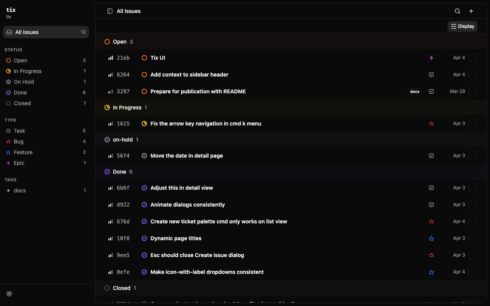
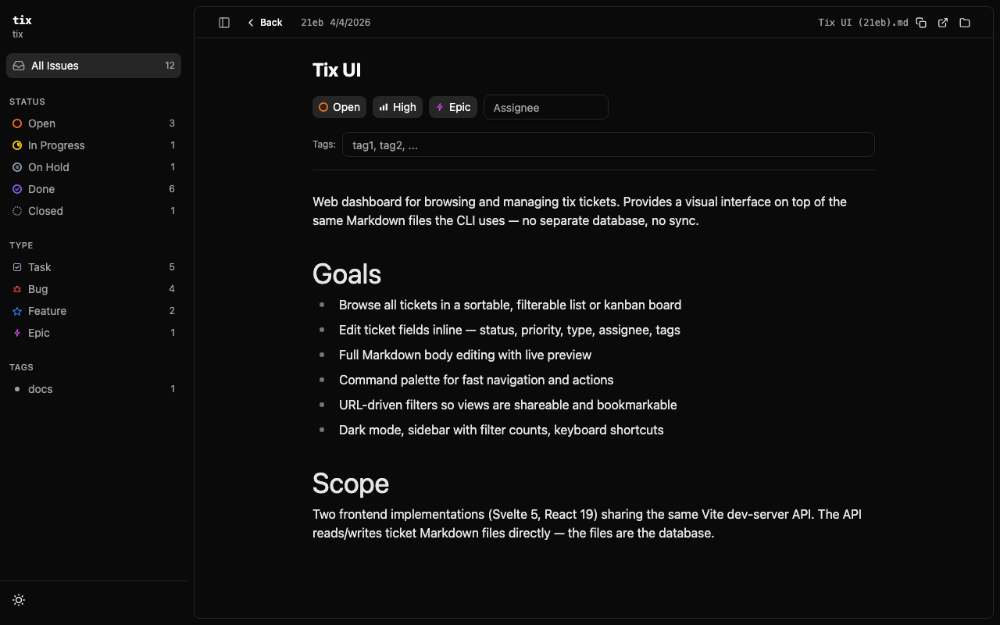

# tix-ui-react

Web dashboard for browsing tix tickets. React 19 frontend with table and kanban views, dark mode, and TanStack Router.





## Quick Start

From the `tix-ui-react/` directory:

```bash
npm install
npm run dev
```

To point at a different workspace:

```bash
TIX_WORKSPACE=/path/to/project npm run dev
```

## Development

```bash
npm run dev       # Dev server with hot reload
npm run build     # Production build to dist/
npm run preview   # Preview production build
```
