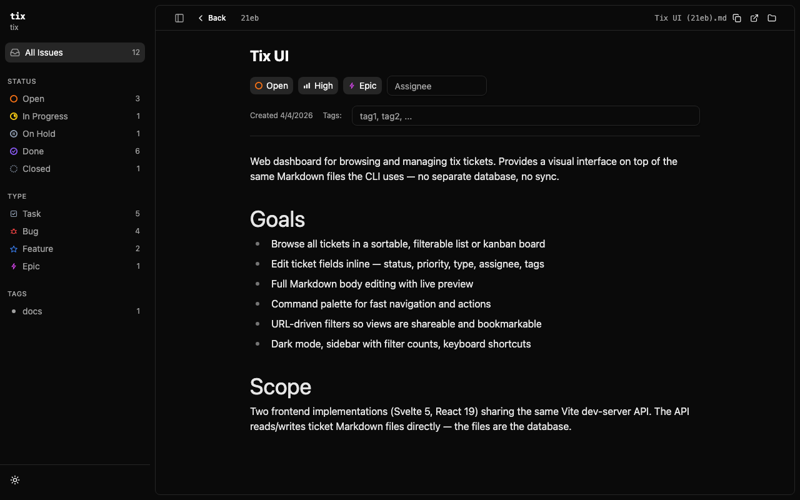

# tix-ui

Web dashboard for browsing tix tickets. Svelte 5 frontend with table and kanban views, dark mode, and live reload.




## Quick Start

From the `tix-ui/` directory:

```bash
npm install
npm run dev
```

Opens in your browser automatically. Reads tickets from `./tickets/` in the current working directory.

To point at a different workspace:

```bash
TIX_WORKSPACE=/path/to/project npm run dev
```

## Usage

The dashboard shows all active tickets in two views:

- **Board** — Kanban columns grouped by status (open, in-progress, done, closed)
- **Table** — Sortable list of all tickets

Click any ticket to see its full details — frontmatter fields, description, acceptance criteria, notes.

## How It Works

Svelte 5 app built with Vite. A custom Vite plugin reads `.md` files from the tickets directory, parses YAML frontmatter with gray-matter, and serves them as JSON over a dev-server API. The frontend fetches ticket data and renders it with Tailwind CSS + DaisyUI.

No backend server needed beyond Vite's dev server. The ticket files are the database.

## Development

```bash
npm run dev       # Dev server with hot reload
npm run build     # Production build to dist/
npm run check     # Type-check Svelte + TypeScript
```
